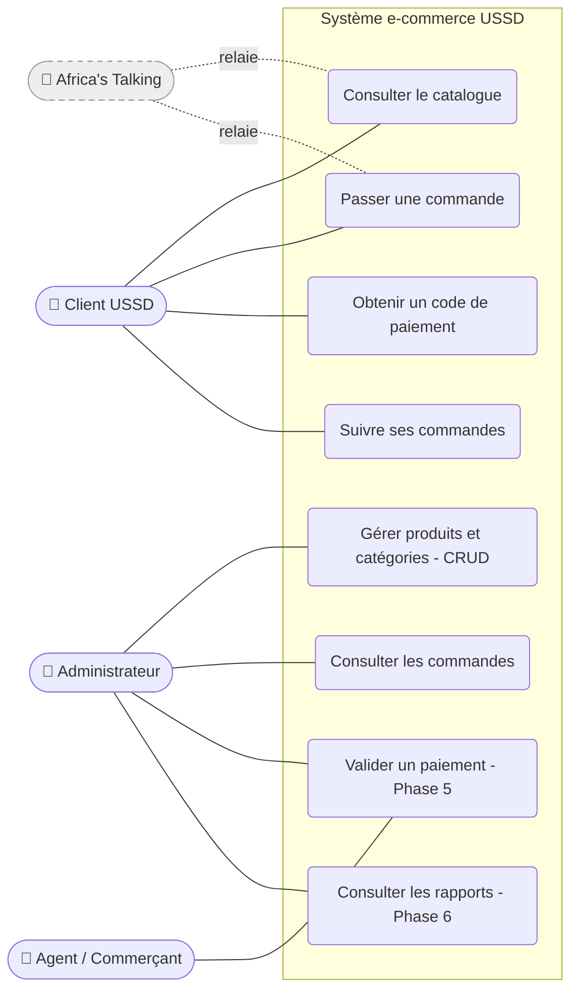
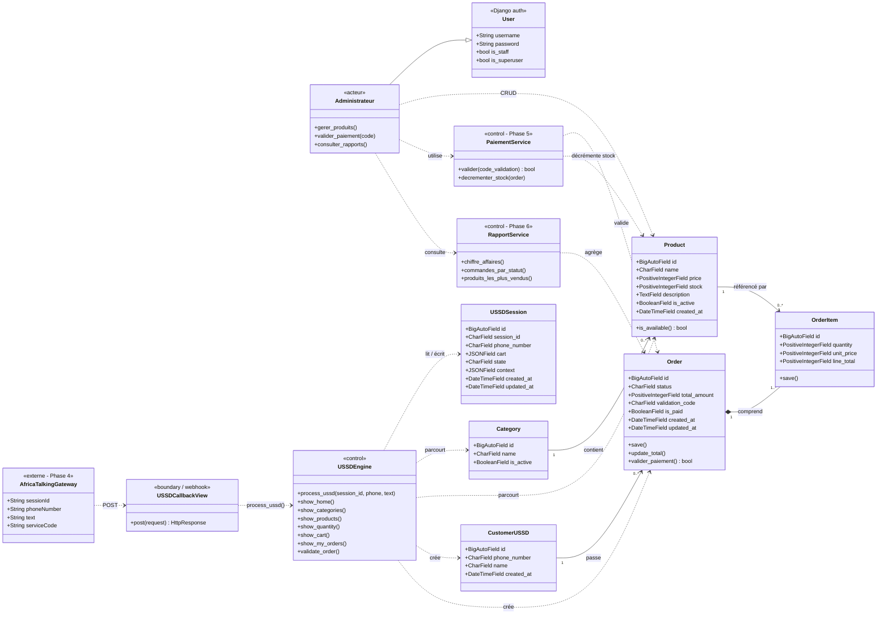
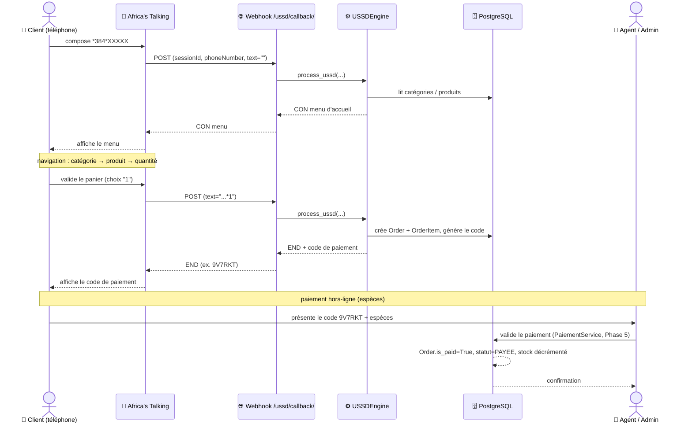
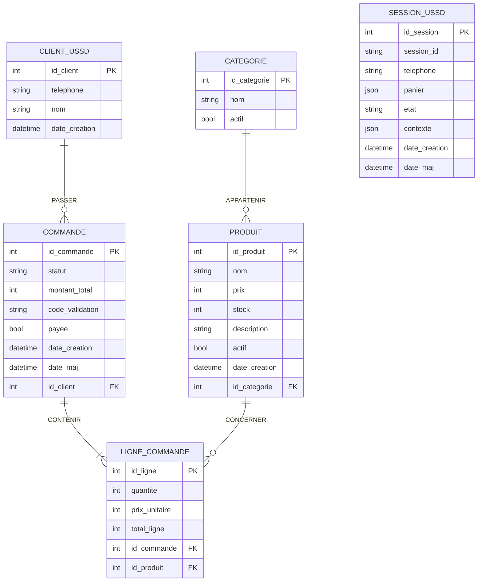

# Diagrammes du projet e-commerce USSD

> Ce document présente la modélisation **complète** du système (parties déjà
> développées **et** parties à venir), sous plusieurs formes complémentaires :
> 1. le **diagramme de cas d'utilisation** (UML — vue fonctionnelle globale) ;
> 2. le **diagramme de classes** complet (UML — vue structurelle) ;
> 3. le **diagramme de séquence** du parcours d'achat (UML — vue dynamique) ;
> 4. le **diagramme Entité-Association** (MCD, méthode MERISE) ;
> 5. le **passage au schéma relationnel** (MLD : les tables PostgreSQL).
>
> Les éléments **non encore développés** sont annotés par phase : `Phase 4`
> (Africa's Talking), `Phase 5` (paiement), `Phase 6` (rapports).
>
> Les diagrammes Mermaid s'affichent graphiquement sur GitHub ; des versions ASCII
> sont fournies en complément.

---

## 1. Diagramme de cas d'utilisation (UML)

Vue d'ensemble des **acteurs** et de **toutes les fonctionnalités** du système.



### Cas d'utilisation par acteur

| Acteur | Cas d'utilisation | État |
|---|---|---|
| **Client USSD** | Consulter le catalogue (catégories, produits) | ✅ fait |
| | Passer une commande (panier multi-produits) | ✅ fait |
| | Obtenir un code de paiement | ✅ fait |
| | Suivre ses commandes | ✅ fait |
| **Administrateur** | Gérer produits et catégories (CRUD) | ✅ fait |
| | Consulter les commandes | ✅ fait |
| | Valider un paiement (saisie du code, décrément du stock) | 🔜 Phase 5 |
| | Consulter les rapports (CA, ventes, statuts) | 🔜 Phase 6 |
| **Agent / Commerçant** | Valider un paiement au comptoir | 🔜 Phase 5 |
| **Africa's Talking** | Relayer les requêtes USSD (passerelle externe) | 🔜 Phase 4 |

---

## 2. Diagramme de classes complet (UML)

Vue structurelle de **tout le système** : acteurs, passerelle, webhook, moteur USSD,
entités du domaine et services à venir.



### Légende des relations

| Notation | Signification |
|---|---|
| `--|>` | Héritage (Administrateur **est un** User Django) |
| `..>` | Dépendance / utilisation (une classe en appelle une autre) |
| `-->` | Association (lien structurel entre entités) |
| `*--` | **Composition** : `OrderItem` n'existe pas sans son `Order` (cascade) |
| `<<...>>` | Stéréotype (rôle de la classe) ; `Phase N` = à développer |

> **Couches** (architecture) :
> - *Acteurs* : `User`, `Administrateur` (et le Client, représenté par `CustomerUSSD`).
> - *Frontière (boundary)* : `AfricaTalkingGateway` (externe), `USSDCallbackView` (webhook).
> - *Contrôle (control)* : `USSDEngine`, `PaiementService`, `RapportService`.
> - *Entités du domaine* : `Category`, `Product`, `CustomerUSSD`, `Order`, `OrderItem`, `USSDSession`.

---

## 3. Diagramme de séquence (UML) — parcours d'achat complet

Vue dynamique : du composé USSD jusqu'au paiement validé, **incluant Africa's
Talking (Phase 4) et la validation du paiement (Phase 5)**.



---

## 4. Diagramme Entité-Association (MCD — MERISE)

Modèle Conceptuel de Données. Cardinalités notées **(min, max)** (convention MERISE).



### Détail des associations et cardinalités (MERISE)

| Association | Entité 1 | Cardinalité | Entité 2 | Cardinalité |
|---|---|---|---|---|
| **APPARTENIR** | PRODUIT | (1,1) | CATEGORIE | (0,n) |
| **PASSER** | COMMANDE | (1,1) | CLIENT_USSD | (0,n) |
| **CONTENIR** | COMMANDE | (1,n) | PRODUIT | (0,n) |

> **Point important (MERISE)** : l'association **CONTENIR** entre `COMMANDE` et
> `PRODUIT` est de type **plusieurs-à-plusieurs (n,m)** et porte des **données
> propres** (*quantité*, *prix unitaire* figé, *total de ligne*). Au passage au
> relationnel, elle devient la table `LIGNE_COMMANDE` (section 5).

> **`SESSION_USSD`** : entité **technique et indépendante** (panier + état de
> navigation). Reliée *logiquement* au client par le numéro de téléphone, sans clé
> étrangère (le panier est volatile, antérieur à la commande).

---

## 5. Passage au schéma relationnel (MLD)

Règles de passage : chaque entité → une table ; chaque association (1,n) → une clé
étrangère côté « plusieurs » ; l'association (n,m) *CONTENIR* → table de jonction
`LIGNE_COMMANDE`.

Légende : `#` = clé primaire, `=>` = clé étrangère.

```
CATEGORIE (#id_categorie, nom, actif)

PRODUIT   (#id_produit, nom, prix, stock, description, actif, date_creation,
           id_categorie => CATEGORIE)

CLIENT_USSD (#id_client, telephone, nom, date_creation)

COMMANDE  (#id_commande, statut, montant_total, code_validation, payee,
           date_creation, date_maj,
           id_client => CLIENT_USSD)

LIGNE_COMMANDE (#id_ligne, quantite, prix_unitaire, total_ligne,
                id_commande => COMMANDE,
                id_produit  => PRODUIT)

SESSION_USSD (#id_session, session_id, telephone, panier, etat, contexte,
              date_creation, date_maj)
```

### Contraintes d'intégrité

| Table | Contrainte |
|---|---|
| `CATEGORIE` | `nom` UNIQUE |
| `PRODUIT` | `prix ≥ 0`, `stock ≥ 0` ; catégorie non supprimable si utilisée (PROTECT) |
| `CLIENT_USSD` | `telephone` UNIQUE |
| `COMMANDE` | `code_validation` UNIQUE ; `statut` ∈ {EN_ATTENTE, PAYEE, PREPAREE, LIVREE, ANNULEE} ; client non supprimable si utilisé (PROTECT) |
| `LIGNE_COMMANDE` | `total_ligne = quantite × prix_unitaire` ; cascade avec la commande ; produit non supprimable si utilisé (PROTECT) |
| `SESSION_USSD` | `session_id` UNIQUE |

### Correspondance noms MERISE ↔ Django ↔ PostgreSQL

| MERISE | Modèle Django | Table PostgreSQL |
|---|---|---|
| `CATEGORIE` | `Category` | `catalog_category` |
| `PRODUIT` | `Product` | `catalog_product` |
| `CLIENT_USSD` | `CustomerUSSD` | `orders_customerussd` |
| `COMMANDE` | `Order` | `orders_order` |
| `LIGNE_COMMANDE` | `OrderItem` | `orders_orderitem` |
| `SESSION_USSD` | `USSDSession` | `ussd_ussdsession` |

> **Clé de `LIGNE_COMMANDE`** : en MERISE « pur », la clé serait la combinaison
> (`id_commande`, `id_produit`). L'implémentation Django conserve une **clé technique**
> auto-incrémentée (`id_ligne`) — plus simple et autorisant plusieurs lignes pour un
> même produit. Les deux approches sont fonctionnellement équivalentes.
