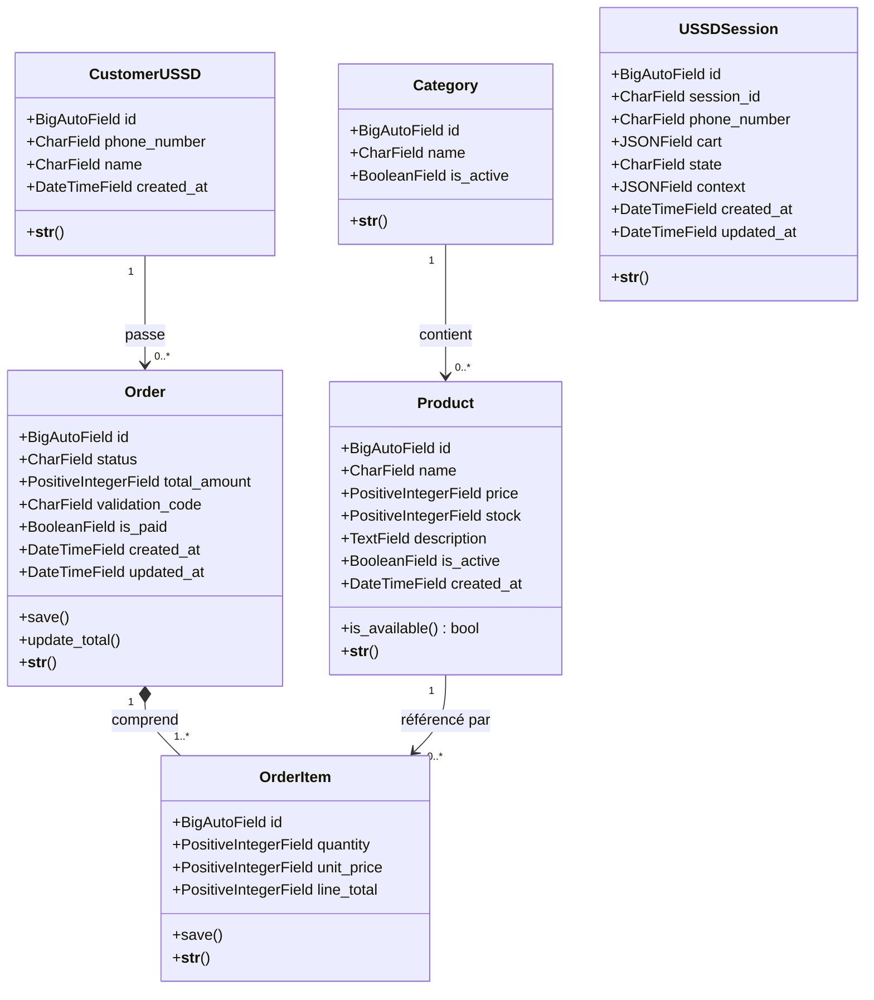
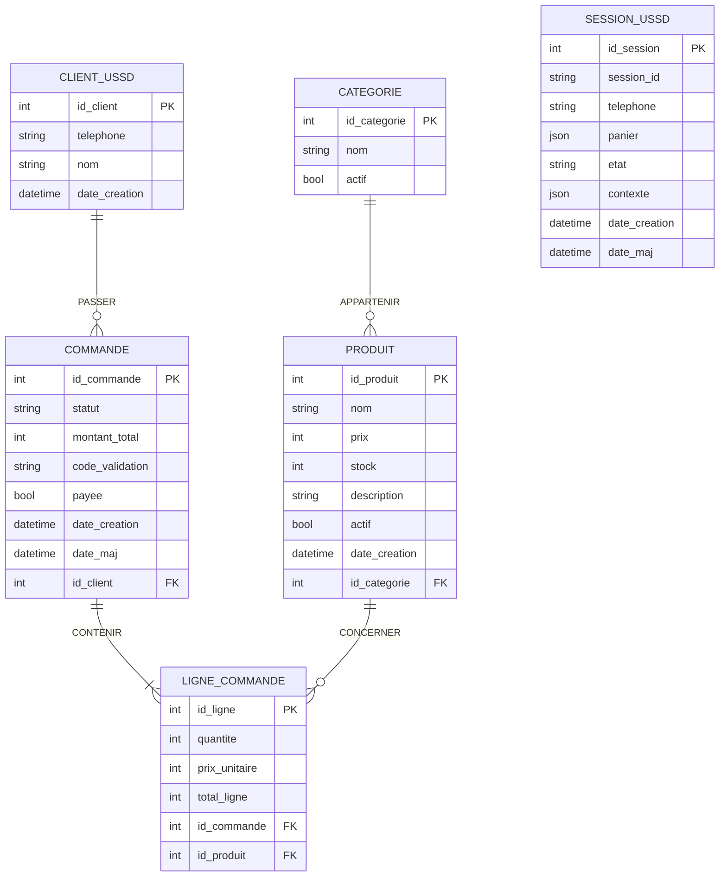

# Diagrammes du projet e-commerce USSD

> Ce document présente la modélisation du système sous trois formes complémentaires :
> 1. le **diagramme de classes UML** (vue orientée objet, proche du code Django) ;
> 2. le **diagramme Entité-Association** (MCD, méthode MERISE) ;
> 3. le **passage au schéma relationnel** (MLD : les tables de la base PostgreSQL).
>
> Les diagrammes Mermaid s'affichent graphiquement sur GitHub ; une version ASCII
> est fournie en complément.

---

## 1. Diagramme de classes UML

Vue orientée objet du système : les classes (modèles Django), leurs attributs,
leurs méthodes et leurs associations.



> Note : la relation `Order` → `OrderItem` est une **composition** (losange plein) :
> une ligne de commande n'existe pas sans sa commande (suppression en cascade).
> Les autres relations sont des **associations** protégées (`on_delete=PROTECT`) :
> on ne peut pas supprimer une catégorie, un client ou un produit encore utilisé.

### Version ASCII

```
+-----------------+           +------------------+
|   Category      | 1     0..*|     Product      |
|-----------------|----------<|------------------|
| id              | contient  | id               |
| name            |           | name             |
| is_active       |           | price            |
+-----------------+           | stock            |
                              | description      |
                              | is_active        |
                              | created_at       |
                              | +is_available()  |
                              +---------+--------+
                                        | 1
                                        | référencé par
                                        | 0..*
+------------------+          +---------v--------+
|  CustomerUSSD    | 1   0..* |    OrderItem     |
|------------------|          |------------------|
| id               |          | id               |
| phone_number     |          | quantity         |
| name             |          | unit_price       |
| created_at       |          | line_total       |
+--------+---------+          | +save()          |
         | 1                  +---------+--------+
         | passe                        | 1..*
         | 0..*                         | comprend (composition)
+--------v---------+ 1                   | 1
|     Order        |---------------------+
|------------------|
| id               |       +-------------------+
| status           |       |   USSDSession     |   (entité indépendante :
| total_amount     |       |-------------------|    panier / etat de session,
| validation_code  |       | id                |    reliée logiquement au client
| is_paid          |       | session_id        |    par le numero de telephone,
| created_at       |       | phone_number      |    sans cle etrangere)
| updated_at       |       | cart (JSON)       |
| +save()          |       | state             |
| +update_total()  |       | context (JSON)    |
+------------------+       | created_at        |
                           | updated_at        |
                           +-------------------+
```

---

## 2. Diagramme Entité-Association (MCD — MERISE)

Modèle Conceptuel de Données. Les cardinalités sont notées **(min, max)** selon la
convention MERISE.



### Détail des associations et cardinalités (MERISE)

| Association | Entité 1 | Cardinalité | Entité 2 | Cardinalité | Sens |
|---|---|---|---|---|---|
| **APPARTENIR** | PRODUIT | (1,1) | CATEGORIE | (0,n) | Un produit appartient à 1 catégorie ; une catégorie regroupe 0..n produits |
| **PASSER** | COMMANDE | (1,1) | CLIENT_USSD | (0,n) | Une commande est passée par 1 client ; un client passe 0..n commandes |
| **CONTENIR / CONCERNER** | COMMANDE | (1,n) | PRODUIT | (0,n) | Une commande contient 1..n produits ; un produit figure dans 0..n commandes |

> **Point important (MERISE)** : l'association **CONTENIR** entre `COMMANDE` et
> `PRODUIT` est de type **plusieurs-à-plusieurs (n,m)** et porte des **données
> propres** : la *quantité*, le *prix unitaire* (figé à l'achat) et le *total de la
> ligne*. Au passage au relationnel, cette association devient une table à part
> entière : `LIGNE_COMMANDE` (voir section 3).

> **Cas de `SESSION_USSD`** : c'est une entité **technique et indépendante** (elle
> stocke le panier en cours et l'état de navigation d'une session USSD). Elle n'a pas
> d'association formelle ; elle est reliée *logiquement* au client par le numéro de
> téléphone, mais sans clé étrangère (le panier est volatile, antérieur à la création
> de la commande).

---

## 3. Passage au schéma relationnel (MLD)

Règles de passage appliquées :
- Chaque **entité** devient une **table**.
- Chaque **association (1,n)** se traduit par une **clé étrangère** dans la table du
  côté « plusieurs ».
- L'**association (n,m)** *CONTENIR* devient une **table de jonction**
  (`LIGNE_COMMANDE`) portant ses attributs propres.

Légende : `#` = clé primaire, `=>` = clé étrangère.

```
CATEGORIE (#id_categorie, nom, actif)

PRODUIT   (#id_produit, nom, prix, stock, description, actif, date_creation,
           id_categorie => CATEGORIE)

CLIENT_USSD (#id_client, telephone, nom, date_creation)

COMMANDE  (#id_commande, statut, montant_total, code_validation, payee,
           date_creation, date_maj,
           id_client => CLIENT_USSD)

LIGNE_COMMANDE (#id_ligne, quantite, prix_unitaire, total_ligne,
                id_commande => COMMANDE,
                id_produit  => PRODUIT)

SESSION_USSD (#id_session, session_id, telephone, panier, etat, contexte,
              date_creation, date_maj)
```

### Contraintes d'intégrité

| Table | Contrainte |
|---|---|
| `CATEGORIE` | `nom` UNIQUE |
| `PRODUIT` | `prix ≥ 0`, `stock ≥ 0` ; suppression de la catégorie interdite si utilisée (PROTECT) |
| `CLIENT_USSD` | `telephone` UNIQUE |
| `COMMANDE` | `code_validation` UNIQUE ; `statut` ∈ {EN_ATTENTE, PAYEE, PREPAREE, LIVREE, ANNULEE} ; suppression du client interdite si utilisé (PROTECT) |
| `LIGNE_COMMANDE` | `total_ligne = quantite × prix_unitaire` ; suppression en cascade avec la commande ; suppression du produit interdite si utilisé (PROTECT) |
| `SESSION_USSD` | `session_id` UNIQUE |

### Correspondance noms MERISE ↔ noms Django

| MERISE (ce document) | Modèle Django | Table PostgreSQL |
|---|---|---|
| `CATEGORIE` | `Category` | `catalog_category` |
| `PRODUIT` | `Product` | `catalog_product` |
| `CLIENT_USSD` | `CustomerUSSD` | `orders_customerussd` |
| `COMMANDE` | `Order` | `orders_order` |
| `LIGNE_COMMANDE` | `OrderItem` | `orders_orderitem` |
| `SESSION_USSD` | `USSDSession` | `ussd_ussdsession` |

> **Remarque sur la clé de `LIGNE_COMMANDE`** : en MERISE « pur », la table issue
> d'une association n,m a souvent pour clé la **combinaison** des clés étrangères
> (`id_commande`, `id_produit`). Dans l'implémentation Django, on conserve une **clé
> primaire technique** (`id_ligne`, auto-incrémentée) — plus simple à manipuler et
> permettant, si besoin, plusieurs lignes pour le même produit. Les deux approches
> sont équivalentes sur le plan fonctionnel.
